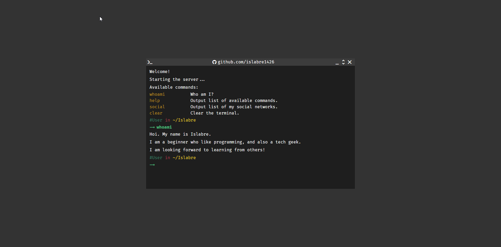

# islabre1426.github.io

# What's this?
This is my Terminal-based Portfolio, mostly for showcasing my works, skills to the world, and my passion about the Terminal.

# Why Terminal-based?
I work with the terminal a lot since this is what many programmers use to develop.

I think it is a good idea to develop a Portfolio based on it.

# What technologies have you used?
- Source-code writing: Visual Studio Code.
- Testing website: Chrome, Firefox.
- Publishing website: Github Pages.
- Version controlling: Git.
- Image Capturing: ShareX.

# License:
- This source-code is under [MIT License](./LICENSE).
- External media and/or projects inspired this website will be listed in [CREDITS](./CREDITS.md) file.